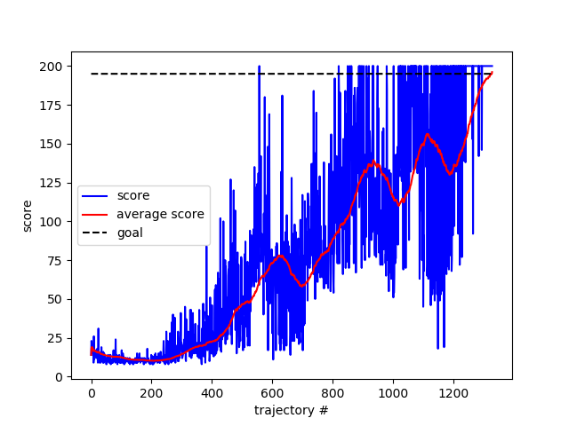

# Policy-gradient-based-method
Solve openai-gym environment with REINFORCE update

# REINFORCE
Consider the "CartPole-v0" environment. We try to solve this environment with the REINFORCE algorithm (a policy gradient based method).
The algorithm uses a stochastic gradient ascent update so that convergence to a **local** optimum is assured for decreasing alpha.
REINFORCE produces slow learning as a Monte Carlo method with potential high variance.

# Neural networks as function approximator
We use a neural network to parametrize the policy. Convergence is not always achieved. Oscillations may appear.

# 'Slow learning', oscillations and local optimum
When using two hidden layers (fully connected), learning generally fails (see below).

Generally speaking, as stated in Sutton (2018), backpropagation algorithm can produce good results for shallow networks, but it may not work well for deeper networks. A shallow network with one hidden layer (unit number = 8) is used to solve this environment.

